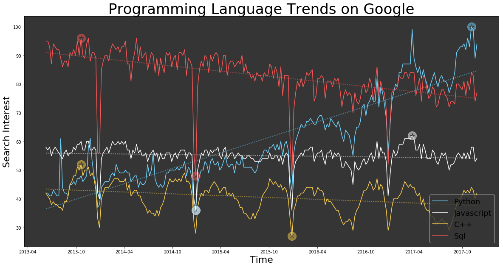

# Programming language trends on google (2014-2017) | Data Sciences Project

Here is a data plotting of the google trends of 4 programming languages (Python, JavaScript, C++ and SQL) from 2014 to 2017.

The program give you an overview of which one of the languages should have an higher demand in the futur 
with a linear regression and the minimum value and maximum value over this period of time.

 
   
   
  

